#### Overview 

This guide covers how to install Authentik via docker-compose as well as the configuration of Oauth 2.0/OpenID Connect for Single Sign On (SSO) Authentication with Portainer. 

------------------------------------
#### Prerequisites

- **Docker Engine** 
- **Portainer**
- **Traefik** Reverse Proxy (Optional)
- **Domain Name** (Optional)
- **DNS Resolver** (Optional)
- **Authentik** Docker-Compose file 
- **.env** environment variable file 

--------------------------------------------

#### Setup Instructions

If Traefik is being used as a reverse proxy, you will need to create a DNS entry in your DNS resolver for a URL. Use Authentik.yourdomain.com for the URL and the IP address of your docker host. 

Example: 

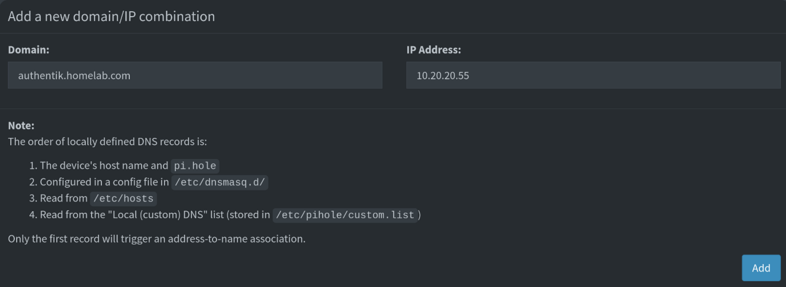


The following docker compose file has been set up using Traefik as a reverse proxy. The only item that needs to be changed here is the entry point in the Traefik labels (traefik.mydomain.com)  

Alternatively, if you prefer to connect directly via IP address, please use the second docker-compose file below which includes port bindings and excludes Traefik labels.

**Docker-compose Traefik:**

```
version: "3.4"

services:
  postgresql:
    image: docker.io/library/postgres:12-alpine
    restart: unless-stopped
    healthcheck:
      test: ["CMD-SHELL", "pg_isready -d $${POSTGRES_DB} -U $${POSTGRES_USER}"]
      start_period: 20s
      interval: 30s
      retries: 5
      timeout: 5s
    volumes:
      - database:/var/lib/postgresql/data
    environment:
      POSTGRES_PASSWORD: ${PG_PASS:?database password required}
      POSTGRES_USER: ${PG_USER:-authentik}
      POSTGRES_DB: ${PG_DB:-authentik}
    env_file:
      - .env
    networks:
      - proxy

  redis:
    image: docker.io/library/redis:alpine
    command: --save 60 1 --loglevel warning
    restart: unless-stopped
    healthcheck:
      test: ["CMD-SHELL", "redis-cli ping | grep PONG"]
      start_period: 20s
      interval: 30s
      retries: 5
      timeout: 3s
    volumes:
      - redis:/data
    networks:
      - proxy

  server:
    image: ${AUTHENTIK_IMAGE:-ghcr.io/goauthentik/server}:${AUTHENTIK_TAG:-2024.6.1}
    container_name: authentik_server
    restart: unless-stopped
    command: server
    environment:
      AUTHENTIK_REDIS__HOST: redis
      AUTHENTIK_POSTGRESQL__HOST: postgresql
      AUTHENTIK_POSTGRESQL__USER: ${PG_USER:-authentik}
      AUTHENTIK_POSTGRESQL__NAME: ${PG_DB:-authentik}
      AUTHENTIK_POSTGRESQL__PASSWORD: ${PG_PASS}
    volumes:
      - ./media:/media
      - ./custom-templates:/templates
    env_file:
      - .env
    depends_on:
      - postgresql
      - redis
    networks:
      - proxy
    labels:
      - "traefik.enable=true"
      - "traefik.http.routers.authentik.entrypoints=http"
      - "traefik.http.routers.authentik.rule=Host(`authentik.mydomain.com`)"
      - "traefik.http.middlewares.authentik-https-redirect.redirectscheme.scheme=https"
      - "traefik.http.routers.authentik.middlewares=authentik-https-redirect"
      - "traefik.http.routers.authentik-secure.entrypoints=https"
      - "traefik.http.routers.authentik-secure.rule=Host(`authentik.mydomain.com`)"
      - "traefik.http.routers.authentik-secure.tls=true"
      - "traefik.http.routers.authentik-secure.service=authentik"
      - "traefik.http.services.authentik.loadbalancer.server.port=9000"
      - "traefik.http.services.authentik.loadbalancer.server.scheme=https"
      - "traefik.docker.network=proxy"

  worker:
    image: ${AUTHENTIK_IMAGE:-ghcr.io/goauthentik/server}:${AUTHENTIK_TAG:-2024.6.1}
    restart: unless-stopped
    command: worker
    environment:
      AUTHENTIK_REDIS__HOST: redis
      AUTHENTIK_POSTGRESQL__HOST: postgresql
      AUTHENTIK_POSTGRESQL__USER: ${PG_USER:-authentik}
      AUTHENTIK_POSTGRESQL__NAME: ${PG_DB:-authentik}
      AUTHENTIK_POSTGRESQL__PASSWORD: ${PG_PASS}
    user: root
    volumes:
      - /var/run/docker.sock:/var/run/docker.sock
      - ./media:/media
      - ./certs:/certs
      - ./custom-templates:/templates
    env_file:
      - .env
    depends_on:
      - postgresql
      - redis
    networks:
      - proxy

volumes:
  database:
    driver: local
  redis:
    driver: local

networks:
  proxy:
    external: true
```


**Docker-Compose Direct Connection**

---
```
version: "3.4"

services:
  postgresql:
    image: docker.io/library/postgres:12-alpine
    restart: unless-stopped
    healthcheck:
      test: ["CMD-SHELL", "pg_isready -d $${POSTGRES_DB} -U $${POSTGRES_USER}"]
      start_period: 20s
      interval: 30s
      retries: 5
      timeout: 5s
    volumes:
      - database:/var/lib/postgresql/data
    environment:
      POSTGRES_PASSWORD: ${PG_PASS:?database password required}
      POSTGRES_USER: ${PG_USER:-authentik}
      POSTGRES_DB: ${PG_DB:-authentik}
    env_file:
      - .env
  redis:
    image: docker.io/library/redis:alpine
    command: --save 60 1 --loglevel warning
    restart: unless-stopped
    healthcheck:
      test: ["CMD-SHELL", "redis-cli ping | grep PONG"]
      start_period: 20s
      interval: 30s
      retries: 5
      timeout: 3s
    volumes:
      - redis:/data
  server:
    image: ${AUTHENTIK_IMAGE:-ghcr.io/goauthentik/server}:${AUTHENTIK_TAG:-2024.6.1}
    restart: unless-stopped
    command: server
    environment:
      AUTHENTIK_REDIS__HOST: redis
      AUTHENTIK_POSTGRESQL__HOST: postgresql
      AUTHENTIK_POSTGRESQL__USER: ${PG_USER:-authentik}
      AUTHENTIK_POSTGRESQL__NAME: ${PG_DB:-authentik}
      AUTHENTIK_POSTGRESQL__PASSWORD: ${PG_PASS}
    volumes:
      - ./media:/media
      - ./custom-templates:/templates
    env_file:
      - .env
    ports:
      - "${COMPOSE_PORT_HTTP:-9000}:9000"
      - "${COMPOSE_PORT_HTTPS:-9443}:9443"
    depends_on:
      - postgresql
      - redis
  worker:
    image: ${AUTHENTIK_IMAGE:-ghcr.io/goauthentik/server}:${AUTHENTIK_TAG:-2024.6.1}
    restart: unless-stopped
    command: worker
    environment:
      AUTHENTIK_REDIS__HOST: redis
      AUTHENTIK_POSTGRESQL__HOST: postgresql
      AUTHENTIK_POSTGRESQL__USER: ${PG_USER:-authentik}
      AUTHENTIK_POSTGRESQL__NAME: ${PG_DB:-authentik}
      AUTHENTIK_POSTGRESQL__PASSWORD: ${PG_PASS}
    # `user: root` and the docker socket volume are optional.
    # See more for the docker socket integration here:
    # https://goauthentik.io/docs/outposts/integrations/docker
    # Removing `user: root` also prevents the worker from fixing the permissions
    # on the mounted folders, so when removing this make sure the folders have the correct UID/GID
    # (1000:1000 by default)
    user: root
    volumes:
      - /var/run/docker.sock:/var/run/docker.sock
      - ./media:/media
      - ./certs:/certs
      - ./custom-templates:/templates
    env_file:
      - .env
    depends_on:
      - postgresql
      - redis

volumes:
  database:
    driver: local
  redis:
    driver: local
```


#### .env Configuration

Use the following .env file for the environment variables in your docker-compose file. 

```
PG_PASS=yourpassword 
AUTHENTIK_SECRET_KEY=generate a secret key 
# SMTP Host Emails are sent to
AUTHENTIK_EMAIL__HOST=smtp.gmail.com
AUTHENTIK_EMAIL__PORT=587
# Optionally authenticate (don't add quotation marks to your password)
AUTHENTIK_EMAIL__USERNAME=brett.nlson@gmail.com
AUTHENTIK_EMAIL__PASSWORD=lnuwrwdxawwejpez
# Use StartTLS
AUTHENTIK_EMAIL__USE_TLS=true
# Use SSL
AUTHENTIK_EMAIL__USE_SSL=false
AUTHENTIK_EMAIL__TIMEOUT=10
# Email address authentik will send from, should have a correct @domain
AUTHENTIK_EMAIL__FROM=brett.nlson@gmail.com

```
Enter the following:

PG_PASS=enter a password
AUTHENTIK_SECRET_KEY=  generate a secret key by running  `openssl rand -base64 32`in your terminal. 

If you wish to use SMTP with Authentik, enter your SMTP details.


If your are not using a reverse proxy, add the following lines after AUTHENTIK_SECRET_KEY

```
COMPOSE_PORT_HTTPS=1443
COMPOSE_PORT_HTTP=7000
```


Deploy with `docker compose up -d`


#### Traefik Configuration


1) Add the following middlewares to your Traefik configuration file (config.yml)

```
 middlewares:
    authentik:
      forwardAuth:
        address: http://authentik_server:9000/outpost.goauthentik.io/auth/traefik
        trustForwardHeader: true
        authResponseHeaders:
          - X-authentik-username
          - X-authentik-groups
          - X-authentik-email
          - X-authentik-name
          - X-authentik-uid
          - X-authentik-jwt
          - X-authentik-meta-jwks
          - X-authentik-meta-outpost
          - X-authentik-meta-provider
          - X-authentik-meta-app
          - X-authentik-meta-version
```


2) Restart your Traefik container via `docker compose up -d --force recreate` and confirm the new middlewares are recognized and there are no errors in the traefik dashboard: 

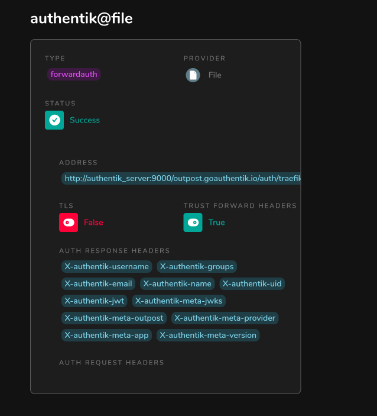


### Authentik Login

1) Once docker has completed deploying the Authentik containers, navigate to:
   https://authentik.mydomain.com/initial-setup or https://localhost/initial-setup:1443


### Connecting Portainer and Authentik 


#### Application Setup


Select **Create a new application**:


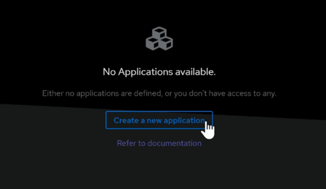


 Enter the **name** and **slug** as below and leave the rest as default: 


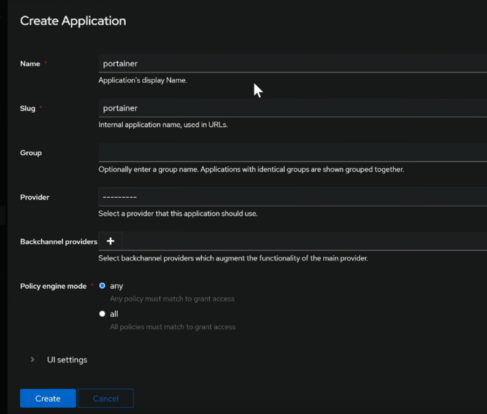


#### Provider Setup

Under the **Applications** tab, select **Providers** and then select **Create**. This will create a provider for your application. 


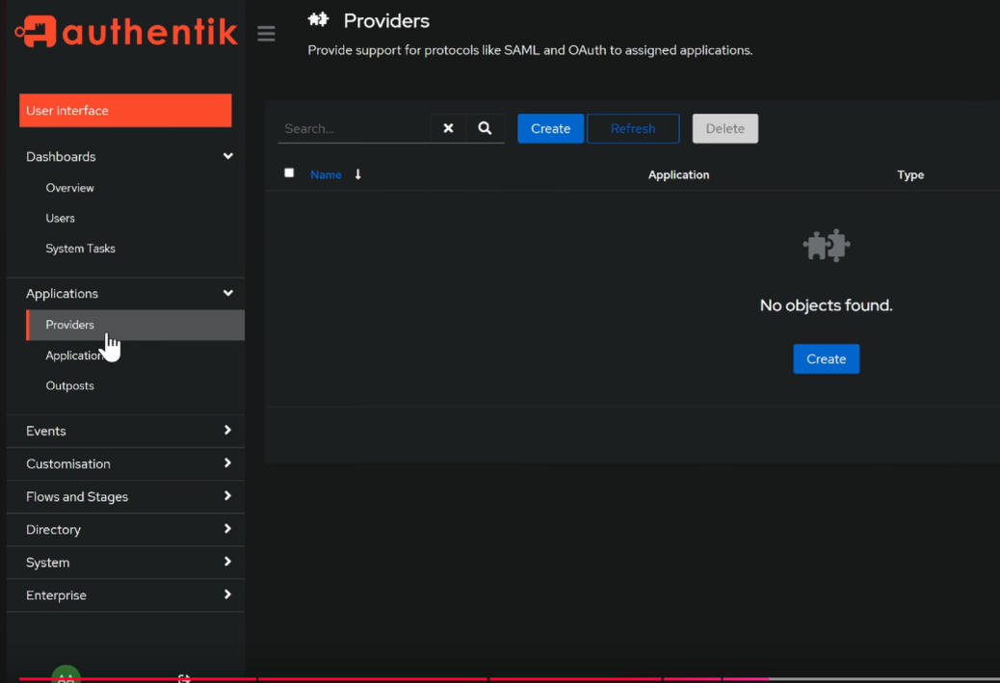


Select **OAuth2/OpenID Provider** as your provider: 

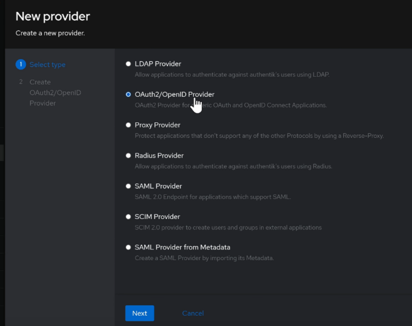

In the **Create Oauth2/OpenID provider** dialog, enter a name. 

- For the **authrorization flow** select "**default-provider-authorization-explicit-consent (Authorize Application)**"
- Client type: Confidential
- Client ID: Leave as default (auto-generated)

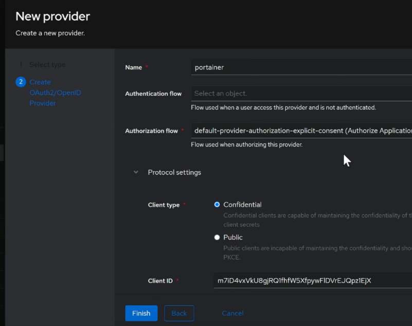


#### Update Application

Return to the **Applications** menu and  in the provider field, you should now see the provider that's been added previously: 


#### Portainer Setup

1) In Portainer in the left column, select **Settings --> Authentication**

2) Select **OAuth** as the authentication method. 

3) Under OAuth Configuration, enter your **Client ID** and **Client Secret.** These can be found by navigating back into Authentik, selecting the **Providers** option and then selecting **edit**

4) For the Oauth configuration links, select the portainer provider name for a list of links in Authentik:

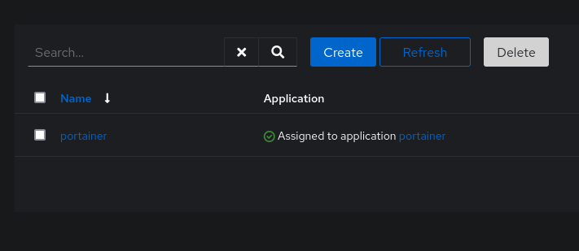

5) Copy the below links from Authentik into your Portainer Oauth Configuration: 


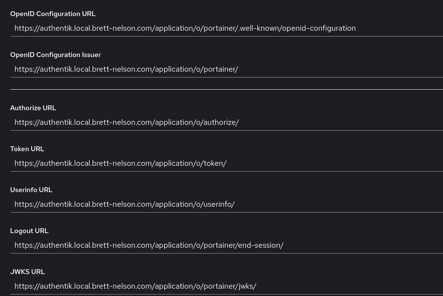

6) Enter the following values for the **User Identifier** and **Scopes**:

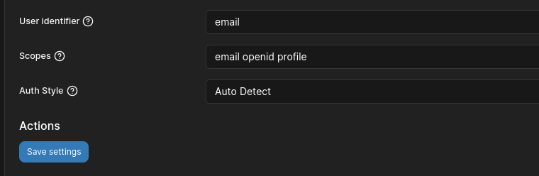


7) Under **User-related** in the left column in Portainer, select **Users** and create a new user with the email address you used to set up Authentik. The Authentication type should default to OAuth


!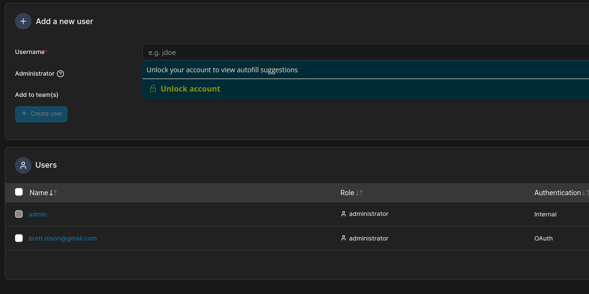


#### Testing Portainer

Log out of Portainer and attempt to login again and you should be presented with an additional Oauth option for sign in.  


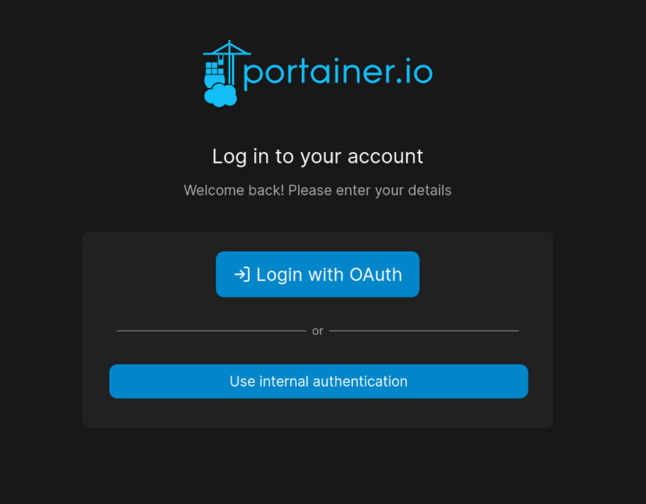


