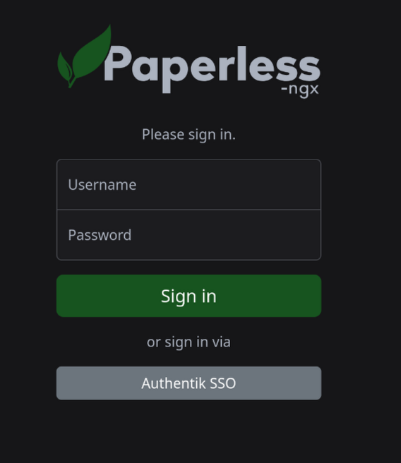
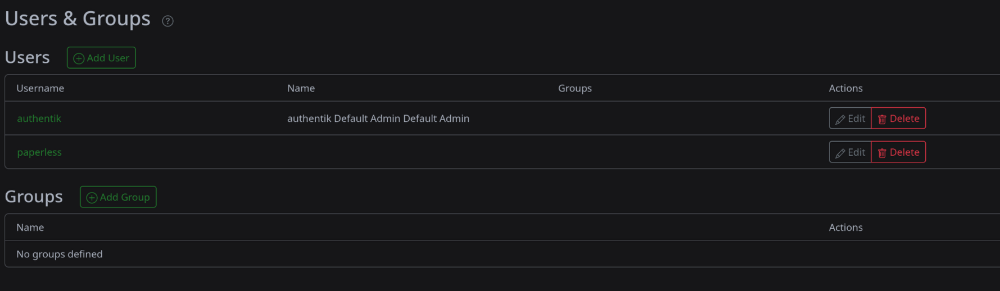
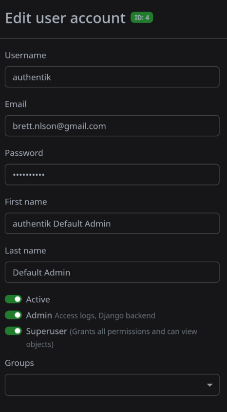

#### Overview

The following outlines how to install paperless using a reverse proxy and Single Sign-On with Authentik. 

----------------------------------------------------
#### Prerequisites

- **Docker Engine**
- **DNS Resolver**
- **Traefik**
- **Authentik**
- **Domain Name**
- **Docker Compose file**
- **.env file** 

---------------------------------------------

#### Authentik -  Setup and Installation

1) Open your Authentik administrator console and create a new provider for Paperless. Set the authentication type to Oauth2. Take note of the client ID and secret. For your redirect URI, use the following link: 

https://paperless.company/accounts/oidc/authentik/login/callback/

2) Under Resources --> Applications, create an application  with these settings:

Name: Paperless Slug: paperless Provider: Paperless

#### Docker Compose - Setup and Installation

1) The following docker compose file can be used to deploy the Paperless containers. Add your Client ID and Secret where it asks for client_id and secret and update the URL's to reflect that of your own domain name. Be sure to create a DNS entry in your DNS resolver. 

```
version: "3.4"
services:
  broker:
    image: docker.io/library/redis:7
    restart: unless-stopped
    volumes:
      - redisdata:/data
    networks:
      paperless:

  db:
    image: docker.io/library/postgres:15
    restart: unless-stopped
    volumes:
      - pgdata:/var/lib/postgresql/data
    environment:
      POSTGRES_DB: paperless
      POSTGRES_USER: paperless
      POSTGRES_PASSWORD: paperless
    networks:
      paperless:

  webserver:
    image: ghcr.io/paperless-ngx/paperless-ngx:latest
    restart: unless-stopped
    depends_on:
      - db
      - broker
      - gotenberg
      - tika
    #ports:
    #  - "8005:8000"
    volumes:
      - data:/usr/src/paperless/data
      - media:/usr/src/paperless/media
      - ./export:/usr/src/paperless/export
      - ./consume:/usr/src/paperless/consume
    env_file: .env
    environment:
      PAPERLESS_REDIS: redis://broker:6379
      PAPERLESS_DBHOST: db
      PAPERLESS_TIKA_ENABLED: 1
      PAPERLESS_TIKA_GOTENBERG_ENDPOINT: http://gotenberg:3000
      PAPERLESS_TIKA_ENDPOINT: http://tika:9998
      PAPERLESS_URL: https://paperless.mydomain.com
      PAPERLESS_ADMIN_USER: paperless
      PAPERLESS_ADMIN_PASSWORD: paperless
      PAPERLESS_APPS: "allauth.socialaccount.providers.openid_connect"
      # Find out how to configure Authentik: https://youtu.be/enwFWELCYJo
      PAPERLESS_SOCIALACCOUNT_PROVIDERS: '{"openid_connect": {"APPS": [{"provider_id": "authentik","name": "Authentik SSO","client_id":aQBxoo5TbaNi4C6OMdDR2gLdRi9OZvUBNfTePy8D "","secret":dwsxh1Pu9TipbHhPYXL73HRCPISj7ZK1D7FzgPogGt89SfbGNG9ZN0nr4zFyxqYzrf4Se2vybw5MfxFN43aH52qTR2vUTGkWcYXdvhDbzEo1bQwFHkZmUkF2pQcBbPF9 "0JcyunvA0Ra25i49zULTbro0jdbH9gHrdnSDExT9Ze2TNoB8so9B8AbdB7riYjYHPZfwuWtAeTCpwPAi2Sct7M8w3y8VTPPxwgFG1JzdoWdxLgUz0NO6l3L2UFBmzQ5m","settings": { "server_url": "https://authentik.jimsgarage.co.uk/application/o/paperless-ngx/.well-known/openid-configuration"}}]}}'
    networks:
      paperless:
      proxy:
    labels:
      - "traefik.enable=true"
      - "traefik.http.routers.paperless.entrypoints=http"
      - "traefik.http.routers.paperless.rule=Host(`paperless.mydomain.com`)"
      - "traefik.http.middlewares.paperless-https-redirect.redirectscheme.scheme=https"
      - "traefik.http.routers.paperless.middlewares=paperless-https-redirect"
      - "traefik.http.routers.paperless-secure.entrypoints=https"
      - "traefik.http.routers.paperless-secure.rule=Host(`paperless.mydomain.com`)"
      - "traefik.http.routers.paperless-secure.tls=true"
      - "traefik.http.routers.paperless-secure.tls.certresolver=cloudflare" 
      - "traefik.http.routers.paperless-secure.service=paperless"
      - "traefik.http.services.paperless.loadbalancer.server.port=8000"
      - "traefik.docker.network=proxy"

  gotenberg:
    image: docker.io/gotenberg/gotenberg:7.10
    restart: unless-stopped

  
    command:
      - "gotenberg"
      - "--chromium-disable-javascript=true"
      - "--chromium-allow-list=file:///tmp/.*"
    networks:
      paperless:

  tika:
    image: ghcr.io/paperless-ngx/tika:latest
    restart: unless-stopped
    networks:
      paperless:

volumes:
  data:
  media:
  pgdata:
  redisdata:

networks:
  paperless:
  proxy:
    external: true
```

2) Create an .env file in your Paperless folder which contains your docker compose file. 

3) Spin up the containers using `docker compose up -d` . If you receive an error 404 not found, just wait a while longer, it means the containers are still spinning up. 

4) Browse to paperless.yourdomain.com and you should be presented with the following

  
	


5) Sign in with the administrator account that was created earlier. Once signed in, select **Users and Groups** from the left column. Select **Edit** for your Authentik user.




 6) Assign the following permissions for your Authentik user: **Admin, Superuser**
 

     

7) You should now be able to sign in via SSO with your Authentik login to use Paperless. 


