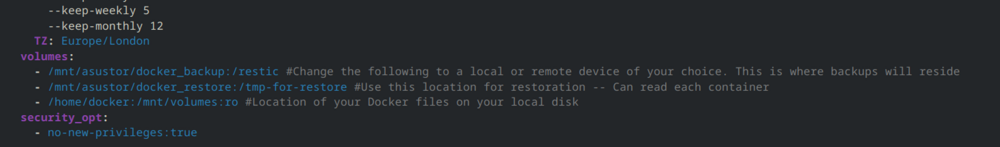
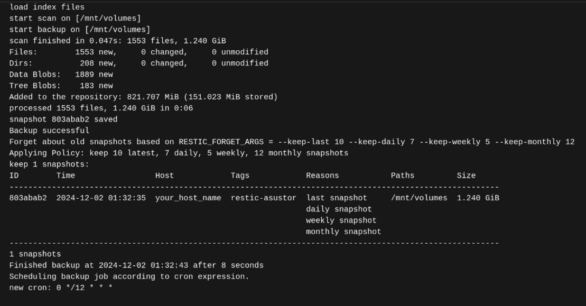

#### Overview 

This guide covers a basic backup/restore method to use when backing up and restoring Docker containers with Restic. First, it details the Docker Compose configuration and running the container and backup, followed by how to restore the backed up containers. 

#### Prerequisites

- **Docker Engine**
- **External Backup Storage** (Recommended)


#### Setup Instructions 


#### Docker Compose Configuration

1) You'll notice a field for each container within the compose file that request a password. Create a password and assign the same password for each container. 

2) Specify your volumes. The first volume is where Restic will be backing up your files, the second location is used for restoration and the third is the location of where the containers reside that you want to back up:



In the above example, I've used an external NAS mounted as /mnt/asustor

#### Running Containers and Checking Logs 

1)  Run `docker compose up -d` and check the log for the Restic container in Portainer to ensure the backup completed successfully. It should have created a snapshot, as indicated by the log file below:



#### Restoring Backups

1) Determine the ID by again checking the backup logs in Portainer for the Restic container, in this case its 803abab2

2) Enter the following command to restore the backups to the docker_restore folder
   
```
   sudo docker exec restic restic restore --target /tmp-for-restore 803abab2
```


This will leave all containers and volumes intact. Copy the folders over to your desired location and spin up your containers from your compose files and the containers should contain all of the data from the most recent incremental backup. 


#backup #docker #restic
